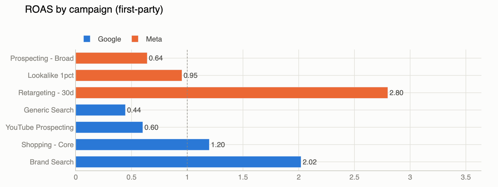
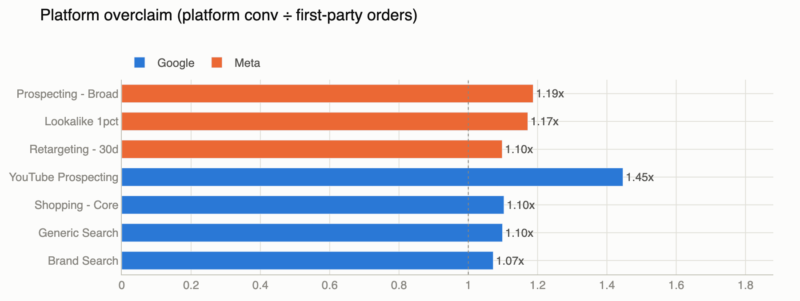

# Ad Analytics Pipeline


**[▶ Live demo](https://ad-reporting-pipeline.streamlit.app)** — the dashboard, running on Streamlit Cloud, seeded by the pipeline itself.

A complete, working ad analytics system: it pulls advertising data the way a
real company would from Google Ads and Meta, cleans and stores it, and turns
it into the numbers a marketing team uses to decide where money goes —
cost per customer, return on ad spend, and how much the ad platforms
exaggerate their own results.

**You can clone it and see it working in two minutes — no ad accounts, no API
keys, no setup beyond Python.**




*Above: which campaigns pay for themselves (break-even line at 1.0), and how
much each platform inflates its conversion numbers compared to actual orders —
here, between 7% and 45%.*

## The interesting part

Real ad data is private, so most portfolio projects settle for a static CSV.
Instead, this project includes a **simulator that impersonates the Google Ads
and Meta APIs** — including the messy behaviors that make real ad pipelines
genuinely hard to build:

- **The numbers change after the fact.** Ad platforms keep updating
  yesterday's (and last week's) conversion counts for ~7 days. A naive
  pipeline silently under-reports; this one re-pulls a trailing window every
  run and updates records in place.
- **APIs push back.** The simulated Meta API rate-limits every 4th request,
  exactly like the real one under load. The pipeline backs off and retries —
  and the test suite proves it.
- **Platforms grade their own homework.** Google and Meta both claim credit
  for the same sale. The pipeline reconciles their claims against a
  first-party "orders database" and reports the gap as its own metric.
- **Data arrives dirty.** Malformed rows are quarantined with a reason
  instead of crashing the run or polluting the warehouse.

Because the simulator's seams match the real APIs, swapping in a real ad
account is a config change, not a rewrite.

## What's in the box

| Piece | What it does |
|---|---|
| `simulator/` | Fake Google Ads / Meta / orders APIs (FastAPI) |
| `pipeline/` | Extract → validate → load → quality checks (Python + DuckDB) |
| `dbt/` | Transform layer: staging → fact → marts as dbt models with data tests |
| `dashboard/` | Interactive Streamlit dashboard |
| `airflow/` | Production scheduling with Airflow, backfills included |
| `tests/` | 10 tests incl. full end-to-end, run on every push via GitHub Actions |

## Try it

```bash
git clone https://github.com/Aman12x/ad-pipeline && cd ad-pipeline
python3 -m venv .venv && source .venv/bin/activate
pip install -r requirements.txt -r requirements-dev.txt

uvicorn simulator.app:app --port 8787   # terminal 1: the fake ad platforms
python -m pipeline.run                  # terminal 2: run the pipeline
streamlit run dashboard/app.py          #             open the dashboard
pytest                                  #             run the test suite (~10s)
```

## Skills demonstrated

Python · SQL (DuckDB) · dbt (models, sources, data tests) · API integration
with retry/backoff · idempotent ETL design · data validation & quality gates ·
testing and CI (pytest, GitHub Actions) · orchestration (Airflow) ·
dashboarding (Streamlit, Plotly)

Engineering details — schema design, idempotency strategy, why upserts instead
of appends, the full failure-mode table — live in
[docs/DESIGN.md](docs/DESIGN.md).
