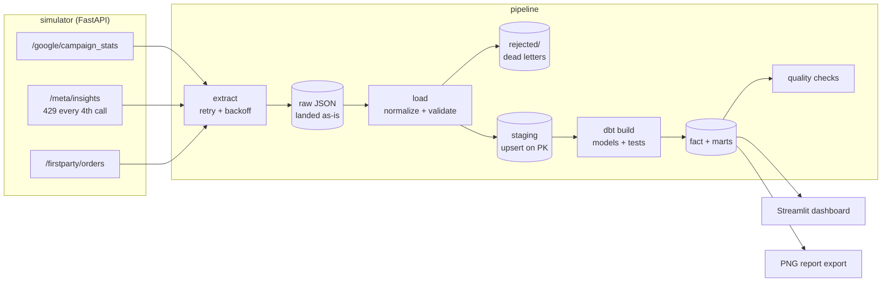
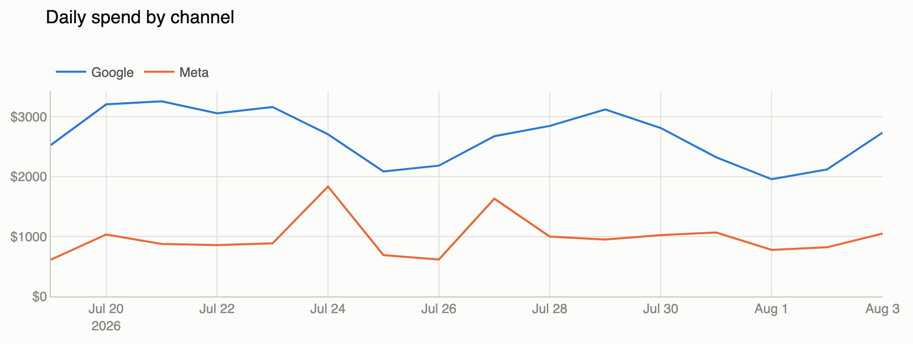

# Design notes

Engineering companion to the [README](../README.md): architecture, failure
modes, and the reasoning behind the design decisions.

Real ad pipelines are hard for reasons a static-CSV project never meets. This
project simulates and handles all of them:

| Production problem | Simulated how | Handled how |
|---|---|---|
| **Conversions restate retroactively** — platforms keep re-attributing conversions for ~7 days after the click | Reported conversions mature from ~50% → 100% of their final value depending on observation date | Every run re-pulls a 14-day trailing window and **upserts** on the natural key; append-only would silently under-report |
| **Rate limits** | Meta endpoint returns HTTP 429 (with `Retry-After`) every 4th call | Exponential backoff honoring `Retry-After`; the e2e test suite survives a 429 on every run sequence |
| **Platforms over-attribute** — Google + Meta + GA4 each claim the same conversion | First-party orders are ~85% of what platforms claim | Platform vs first-party conversions kept as **separate columns, never summed**; the gap ships as an `overclaim_ratio` metric |
| **Schema quirks** | Google: camelCase, `costMicros`, int64-as-strings; Meta: conversions buried in an `actions` array | All normalization isolated in one layer (`pipeline/load.py`), unit-tested against malformed payloads |
| **Bad rows** | — | Dead-lettered to `data/rejected/` with a reason; one garbage row never aborts a run |

## Architecture

Every run: pull trailing 14-day window → land raw JSON untouched (replayable)
→ normalize/validate → upsert staging → `dbt build` (fact + mart models and
their schema/singular tests) → data-quality gate → record run metadata in
`pipeline_runs`.

The transform layer lives in `dbt/`: staging tables are declared as dbt
sources with column tests; the fact table and marts are models; singular
tests enforce cross-column invariants (PK uniqueness, clicks ≤ impressions,
no negative metrics, WoW contribution shares summing to 1). A test failure
fails the build, which fails the run — bad data never reaches the marts.

### Marts

| Model | Question it answers | SQL of note |
|---|---|---|
| `mart_campaign_daily` / `mart_channel_daily` | What are CAC/ROAS/overclaim right now? | — |
| `mart_campaign_rolling` | Is efficiency trending, and is the creative fatiguing? | 7-day windows (`rows between 6 preceding`), `ctr_vs_peak` via windowed max over the campaign's own history |
| `mart_channel_pacing` | Will we hit the monthly budget? | MTD running sum vs a budget prorated with `last_day()`; joined to the `monthly_budgets` seed |
| `mart_campaign_weekly` | Which campaign drove this week's change? | `lag()` per campaign, each campaign's share of the channel's total spend delta (sums to 1 per channel-week, enforced by a singular test) |

## From raw data to decision

The marts answer the questions a growth team actually asks: which campaigns
are above/below break-even ROAS (shift budget), what CAC really is when
measured against **first-party orders** instead of platform claims, and how
much each platform over-attributes (here: 7–45%).

## Synthetic data realism

The generator is deterministic per (campaign, date) — required for replayable
tests and idempotency proofs — but reproduces the statistical texture of real
ad data on top of that determinism:

- **Log-normal daily noise with AR(1) persistence** (φ = 0.55, implemented as
  a truncated moving average of per-day seeded gaussians, so it stays
  stateless). Measured lag-1 autocorrelation of daily spend: ~0.4 — good and
  bad days cluster, as in real accounts.
- **Campaign lifecycle**: a ~5-day learning ramp after each creative refresh,
  then CTR fatigue decay toward ~0.7 of peak on a ~75-day refresh cycle — so
  the fatigue mart has real structure to detect.
- **Shock days**: ~2% of channel-days are promo spikes (1.6–2.8× volume),
  ~1% are tracking outages (~0.45×) — the heavy tail the spend-anomaly
  alert exists for, and occasionally visible firing on the live demo.
- **Campaign-type-specific over-attribution**: each campaign has an
  `fp_share` (fraction of platform-claimed conversions that are real
  first-party orders) — brand search ~0.95 (overclaims ~2%), retargeting and
  YouTube view-through ~0.55–0.60 (overclaim 1.6–1.8×), matching the real
  pattern that view-through attribution inflates most.
- **Front-loaded conversion maturity**: ~55% of conversions visible same-day,
  ~77% by day 1, ~88% by day 2, fully restated from day ~10 — an exponential
  approach, not the linear ramp of a naive simulator.
- **Log-normal order values** (median $55, σ = 0.65 → mean ≈ $68, occasional
  $300+ orders), with mean-preserving stochastic rounding of small campaigns'
  order counts so low-volume campaigns aren't biased by integer truncation.

## Testing

- **Parser unit tests** — schema normalization, malformed payloads
  dead-lettered without killing the batch, sanity rules (clicks ≤ impressions)
- **End-to-end** — boots the real simulator, runs the pipeline three times and
  asserts: restatement picked up (same stat date, higher conversions),
  idempotency (repeat run adds zero rows), 429 survived, quality gates pass,
  every run tracked
- Tests pin their `as_of` dates and the simulator derives everything from
  `as_of`, so CI is deterministic — green today, green in a year

## Orchestration

`airflow/dags/ad_pipeline_dag.py` runs the stages as separate tasks
(extract → load → transform → quality) on a daily schedule with retries. The
DAG maps Airflow's logical date to the pipeline's `as_of`, so
`airflow dags backfill` replays history correctly. The same stages run
without Airflow via `python -m pipeline.run` — orchestration is a wrapper,
not a dependency.

## Design decisions

- **Trailing-window upserts, not append-only** — the restatement problem makes
  append-only ingestion silently wrong; this is the single most important
  design choice in any ad pipeline.
- **Raw payloads landed before parsing** — any load bug can be replayed from
  disk without re-hitting (rate-limited) APIs.
- **Fact/marts fully rebuilt from staging each run** (dbt `table`
  materializations) — trivially idempotent; switching to dbt `incremental`
  models is a scale problem this data volume doesn't have yet.
- **First-party truth joined at (source, campaign, day)** via UTM tags —
  click-ID-level joins need click-level exports; campaign-day granularity
  answers the budget questions without them.
- **Quality checks as a pipeline stage** — PK uniqueness, non-negative
  metrics, clicks ≤ impressions, freshness — failing the run rather than
  publishing bad marts.
- **Anomaly alerts are soft, integrity failures are hard** — the quality
  stage also flags any channel whose latest daily spend sits >3σ from its
  trailing-14-day baseline, records it in `quality_alerts`, and surfaces it
  as a banner on the dashboard. It deliberately does *not* fail the run: an
  unusual-but-real spend day is a signal for a human, not corrupt data, and
  blocking the marts would hide the very numbers needed to investigate it.
  (Cold start is handled: fewer than 7 baseline days → no claims.)
- **The most recent day is excluded from efficiency metrics** — first-party
  orders land with a 1-day lag; showing a CAC computed on zero orders would
  be a lie. The dashboard says so instead.

## Swapping in real APIs

The simulator exists so the pipeline can be built and tested without
credentials — but the seams are real: replace the three URL builders in
`pipeline/extract.py` with authenticated calls (Google Ads GAQL, Meta
`/insights`, your orders DB) and everything downstream runs unchanged.
